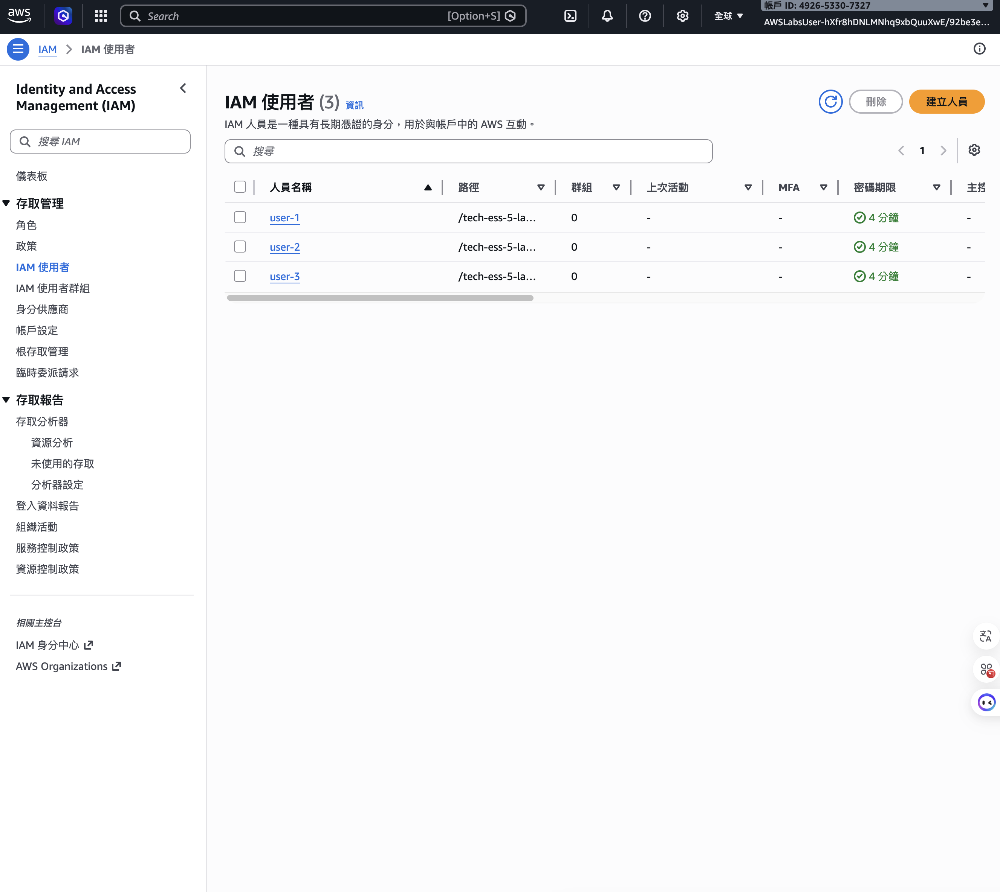
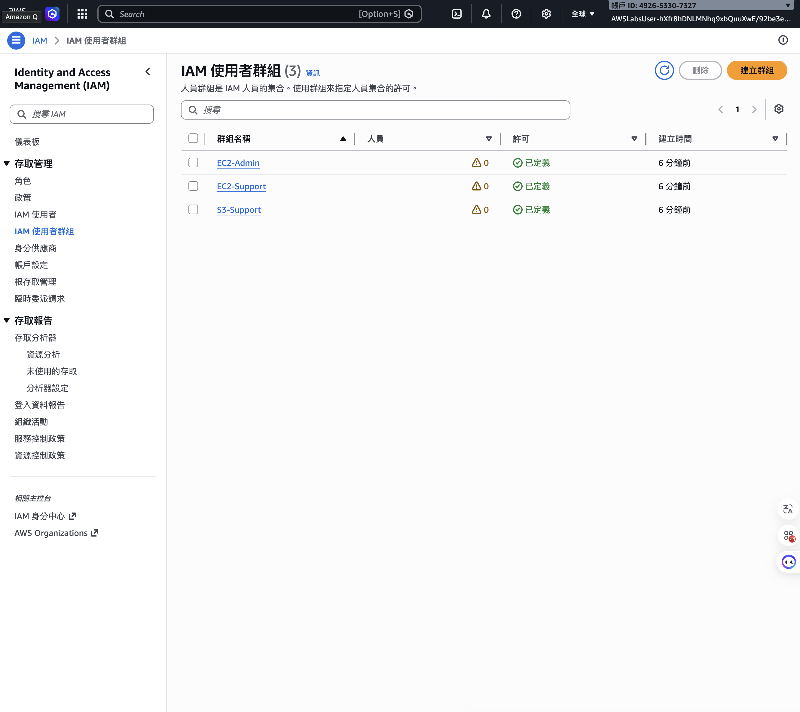
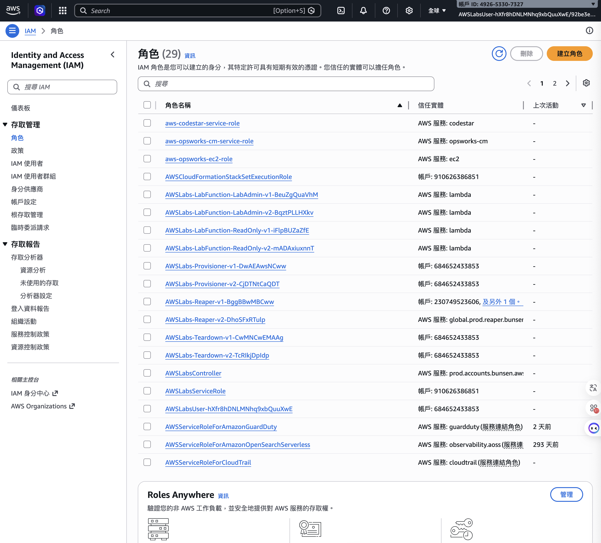

# 01 — IAM & Security

## AWS Services Used
- AWS IAM (Users, Groups, Roles, Policies)
- AWS Root User Protection
- Multi-Factor Authentication (MFA)

## What I Built
- Reviewed 3 IAM Users with assigned access paths
- Explored 3 IAM Groups: EC2-Admin, EC2-Support, S3-Support
- Examined 29 IAM Roles including service and lab roles
- Completed Lab 1: Introduction to IAM (Grade: 100%)

## Key Concepts Learned

### Shared Responsibility Model
| AWS Responsible | Customer Responsible |
|----------------|---------------------|
| Physical hardware | IAM Users & permissions |
| Global infrastructure | MFA configuration |
| Hypervisor | Data encryption |
| Managed services | Application security |

### IAM Components
| Component | Purpose |
|-----------|---------|
| User | Individual identity with long-term credentials |
| Group | Collection of users sharing permissions |
| Role | Temporary permissions assumed by services/users |
| Policy | JSON document defining allowed actions |

### Root User Best Practices
- Never use root for daily tasks
- Enable MFA immediately after account creation
- Create admin IAM user for regular use

## Screenshots

### IAM Dashboard

### IAM Users

### IAM Groups

### IAM Roles

## Lessons Learned
- IAM Role vs IAM User: Roles are for services/temporary access, Users are for people
- Least privilege principle: only grant permissions actually needed
- Groups simplify permission management — assign policies to groups, not individual users
